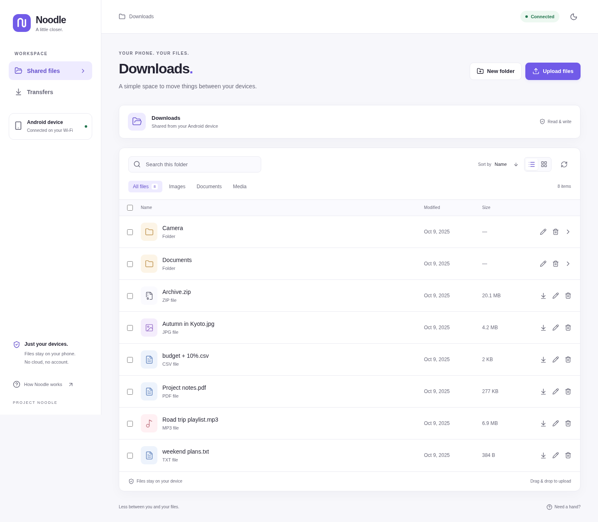
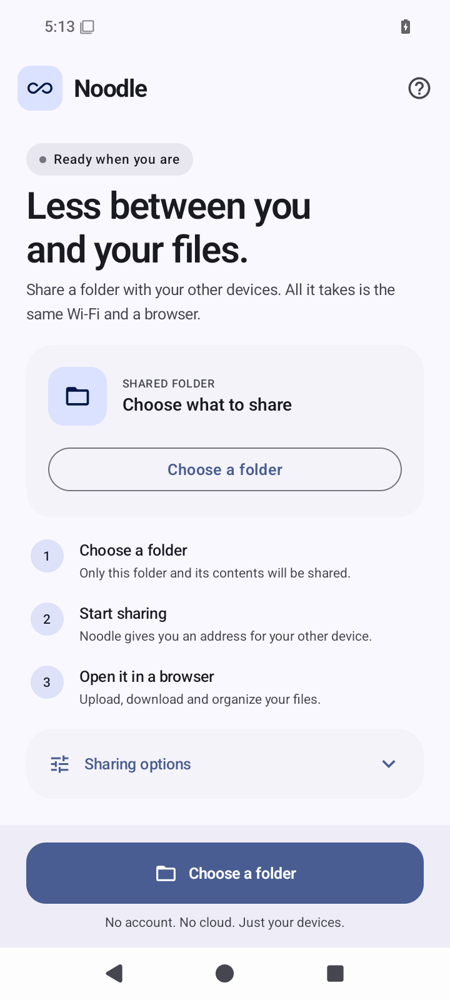
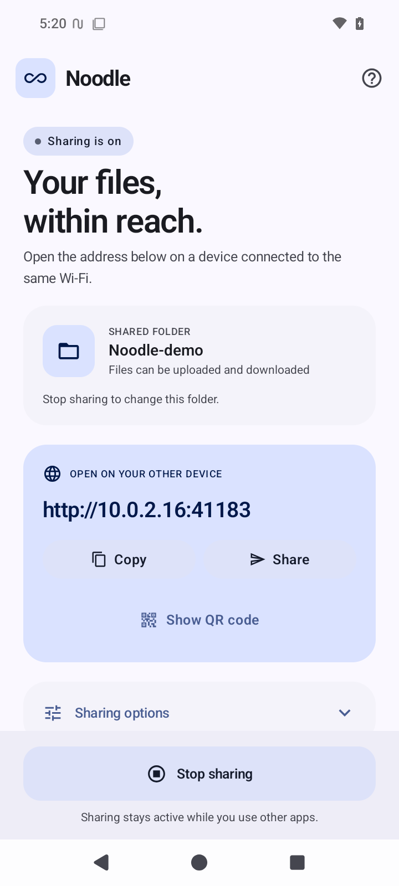

# Project Noodle

Move files between your Android phone and another device using the same Wi-Fi and a browser. No account or cloud storage.

[Download the latest APK](https://github.com/fixing-things-enjoyer/ProjectNoodle/releases/latest)

## Three steps

1. **Choose a folder** on your phone.
2. Tap **Start sharing**.
3. Open the displayed address on your other device, or scan the QR code.

Click a file to download. Upload files using the button or drag and drop. Search, create folders, rename and delete from the browser. Changes apply to the shared files on your phone. Tap **Stop sharing** when finished.

Both devices must use the same Wi-Fi, or connect the other device to your phone's hotspot. Some guest Wi-Fi networks prevent devices from reaching each other.

## Made for your devices

- Android Material 3 interface, system light/dark theme and wallpaper colors.
- Copy, share or scan your connection address.
- Responsive React file browser with list/grid views and light/dark themes.
- Upload queue, progress, cancellation and clear errors.
- Optional device approval, available in the app and notifications.
- Optional HTTPS under Sharing options. It uses a local self-signed certificate, so your browser shows a certificate warning.
- Read-only folders supported; existing files are never silently overwritten.

## Preview

Browser previews use example files from the test suite. Android previews were captured from the built app. See the [actual Android-hosted browser](docs/screenshots/web-hosted.png) too.






## Build

The Android app and React UI live in this repository. No sibling checkout or manual asset copying is needed. Install Java 17, Node 24 and Android SDK 35, then run:

```bash
./gradlew assembleDebug
```

APK: `app/build/outputs/apk/debug/app-debug.apk`. Gradle installs the locked npm dependencies and builds the embedded UI automatically.

| Directory | Contents |
| --- | --- |
| `app/` | Android app, foreground sharing service, HTTP/HTTPS server, tests |
| `webui/` | React source, styles, npm lockfile, browser and accessibility tests |
| `.github/workflows/` | Automatic checks, downloadable debug APKs, signed tagged releases |
| `docs/` | Architecture, development and release instructions |

See [architecture and migration](docs/architecture.md) and [development and releases](docs/releases.md).

## Release

Push a version tag such as `v2.0.0`. GitHub runs all checks, builds and verifies a signed APK, then publishes it with a checksum and release notes. Existing signing secret names remain supported.

## License

Apache 2.0. See [LICENSE](LICENSE).
