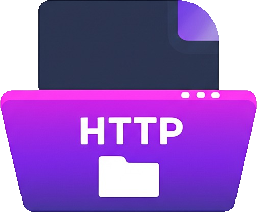

# Project Noodle

Project Noodle transforms your Android device into a personal, portable file server, accessible directly through any web browser on your local network. Share files, manage directories, and facilitate seamless data transfer without the need for cloud services or complex setups.

## ✨ Features

*   **Effortless Sharing:** Host files and folders directly from your Android device.
*   **Intuitive Web Interface:** A clean, responsive web UI for easy browsing, uploading, downloading, renaming, deleting, and creating folders.
*   **Universal Access:** Connect from any device (phone, tablet, PC) with a web browser on the same Wi-Fi network.
*   **Enhanced Security Options:**
    *   **Connection Approval:** Opt to require manual approval for new client connections via a notification.
    *   **HTTPS Support:** Enable encrypted connections with self-signed certificates for increased privacy (requires browser trust bypass).
*   **Reliable Operation:** Runs as a foreground service, ensuring your server remains active even when the app is in the background.

## 🚀 Getting Started

1.  **Launch Project Noodle:** Open the app on your Android device.
2.  **Select Shared Directory:** Tap "Select Directory (SAF Picker)" and choose the root folder you wish to share. This grants the app necessary permissions via Android's Storage Access Framework.
3.  **Configure (Optional):**
    *   Toggle "Require Connection Approval" to get notifications for new connections.
    *   Toggle "Use HTTPS (Self-Signed)" to enable encrypted web traffic. Note that self-signed certificates will trigger browser warnings, which you'll need to bypass (e.g., by clicking "Advanced" and "Proceed anyway").
4.  **Start the Server:** Tap "Start Server". The app will display the server's URL (e.g., `http://192.168.1.100:54321`).
5.  **Access from Browser:** Open the displayed URL in any web browser on a device connected to the **same Wi-Fi network**.
6.  **Approve Connections:** If "Require Connection Approval" is enabled, a notification will appear on your Android device for each new client. Tap "Approve" to grant access.
7.  **Manage Files:** Browse, upload, download, and manage your files directly from the browser.
8.  **Stop the Server:** Tap "Stop Server" in the app to shut down the service.

## 🛠️ Built With

*   **Kotlin:** Modern programming language for Android development.
*   **Android Jetpack Compose:** Declarative UI toolkit for a native Android experience.
*   **NanoHTTPD:** A tiny, extensible HTTP server.
*   **Bouncy Castle:** Cryptography APIs for generating self-signed SSL/TLS certificates.

## 🤝 Contributing

Contributions are welcome! Feel free to open issues or submit pull requests.

## 📄 License

This project is released under the **Apache License 2.0**. See the `LICENSE` file for more details.

## 👤 Author

*   **fixingthingsenjoyer**

---
